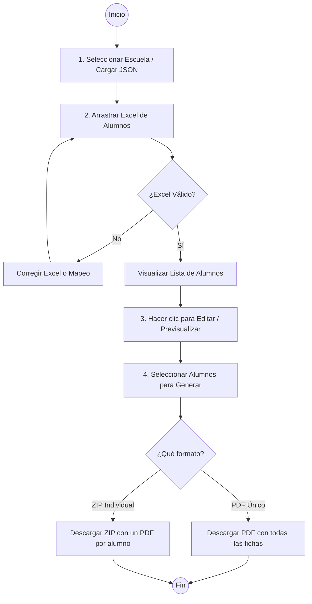
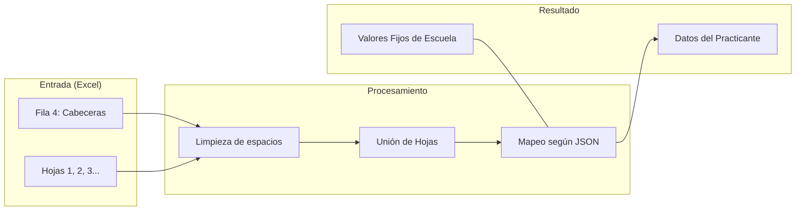
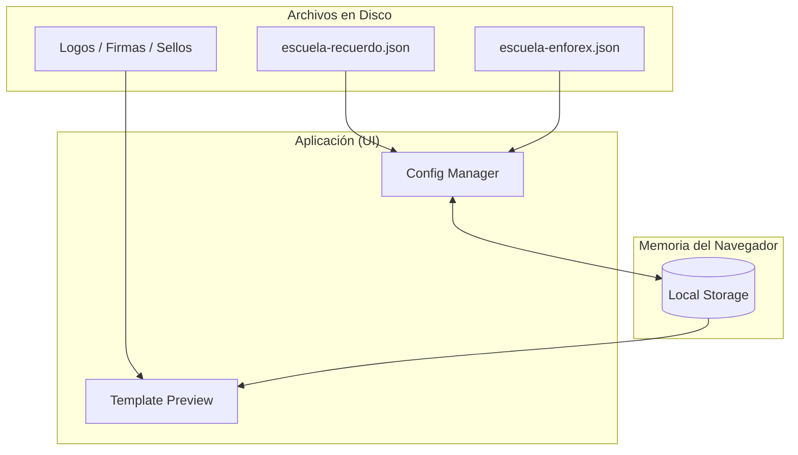

# Diagramas de Proceso - Generador de Fichas

Estos diagramas representan visualmente el funcionamiento de la aplicación descrito en el manual de usuario.

---

## 1. Flujo de Trabajo del Usuario

Este diagrama describe los pasos que debe seguir un usuario desde que abre la aplicación hasta que obtiene los documentos.

---

## 2. Preparación y Mapeo de Datos

Cómo se transforman los datos desde el archivo físico hasta la plantilla final.

---

## 3. Arquitectura de Configuración

Relación entre los archivos del sistema y la personalización del usuario.

